# ⚡️ Resurrector V2: The Self-Healing DevOps Engine

<div align="center">


-orange?style=for-the-badge)


**An autonomous AI workforce that hunts bugs, patches code, and audits itself—while you sleep.**

[View Traces](#-observability-the-x-ray) • [Report Bug](https://github.com/DHRUVBSTHAKUR/resurrector-v2/issues)

---

### 🎥 Watch Level 4 Autonomy in Action
*The agent detects a `ZeroDivisionError`, attempts a fix, gets REJECTED by the Security Auditor, auto-corrects, and passes on the second try.*


</div>

---

## 🛑 The "Million Dollar" Problem
Modern CI/CD pipelines are fragile. A missing dependency, a forgotten colon, or a logic error can halt production for hours while on-call engineers scramble.
> **The Solution:** A **Multi-Agent AI System** that doesn't just "suggest" code—it spins up a secure sandbox, reproduces the crash, fixes it, and **verifies the fix** against a rigorous security audit before merging.

## 🧠 System Architecture (Level 4 Autonomy)

This isn't a simple chatbot. It is a **Self-Correcting Reasoning Loop** built on **LangGraph**.

```mermaid
flowchart TD
    %% Shapes: ([Round]), [Rect], {Rhombus}
    Failure(["🔥 Pipeline Failure"]) --> Junior["👨‍💼 Junior Agent<br/>(Execution)"]
    
    Junior -- "Reads Logs & Edits Code" --> Sandbox["🐳 Docker Sandbox"]
    Sandbox -- "Returns stdout/stderr" --> Junior
    
    Junior -- "Submits Fix Proposal" --> Security{"🛡️ Security Audit<br/>(Principal Engineer)"}
    
    Security -- "❌ REJECT (Unsafe/Untested)" --> Junior
    Security -- "✅ APPROVE" --> Merge(["🚀 Merge Fix & Notify"])

    style Junior fill:#e1f5fe,stroke:#01579b,color:#000
    style Security fill:#fff9c4,stroke:#fbc02d,color:#000
    style Sandbox fill:#f3e5f5,stroke:#4a148c,color:#000
```


## 🎛️ Mission Control Center
I built a dedicated dashboard to monitor the autonomous workforce in real-time. It tracks token usage, accumulated costs (USD), and live reasoning logs as the agents work.


### 🎭 The Cast
1.  **👷‍♂️ Agent A: The Junior DevOps (Execution)**
    * **Role:** The "Hands." Reads `stderr` logs, locates files, and injects fixes.
    * **Constraint:** Must provide "Proof of Work" (successful execution logs) before submitting.
    * **Engine:** `Gemini 2.0 Flash` (P50 Latency: 1.3s).

2.  **🛡️ Agent B: The Principal Security Engineer (Audit)**
    * **Role:** The "Eyes." Reviews the PR for security risks (e.g., `rm -rf`, infinite loops).
    * **Power:** Can **REJECT** the fix and force Agent A to retry.
    * **Engine:** `Gemini 2.0 Flash` (Strict Prompting).

---

## 📊 The "Gauntlet": Performance Benchmark
I subjected the system to a regression suite of 3 distinct failure modes. It achieved a **100% Success Rate** with zero human intervention.

| Failure Mode | Bug Type | Agent Behavior | Time-to-Fix | Status |
| :--- | :--- | :--- | :--- | :--- |
| **Missing Lib** | `ImportError` | Installed dependency via `pip` | **~2.9s** | ✅ PASSED |
| **Syntax Error** | `SyntaxError` | Parsed trace, inserted colon | **~2.3s** | ✅ PASSED |
| **Logic Crash** | `ZeroDivision` | **REJECTED** 1st attempt → Refactored → **APPROVED** | **~5.4s** | ✅ PASSED |

> **📉 Cost Efficiency:** The entire regression suite runs for **<$0.01** using Gemini 2.0 Flash.

---

## 🛠️ Tech Stack & Engineering
* **Orchestration:** [LangGraph](https://langchain-ai.github.io/langgraph/) (Stateful Multi-Agent Loops)
* **Sandboxing:** [Docker](https://www.docker.com/) (Ephemeral Execution Environments)
* **Intelligence:** [Google Gemini 2.0 Flash](https://deepmind.google/technologies/gemini/) (Multimodal Reasoning)— Chosen for its sub-second latency and massive context window, allowing agents to parse thousands of log lines for <$0.01 per run.
* **Observability:** [Arize Phoenix](https://phoenix.arize.com/) (OpenTelemetry Tracing)
* **Notifications:** [Twilio](https://www.twilio.com/) (Voice Alerts on Success)


## 📂 Project Structure

```bash
resurrector-v2/
├── agents/             # Logic for Junior and Senior Agents
├── sandbox/            # Docker container configurations
├── tools/              # Custom tools (File edit, Linting, Shell)
├── benchmarks/         # The "Gauntlet" regression suite
├── main.py             # Entry point (LangGraph orchestration)
└── pyproject.toml      # UV dependency management
```


## 🔬 Observability (The "X-Ray")
Every thought, tool call, and state transition is traced live via **Arize Phoenix**. This allows for deep inspection of "why" an agent failed or succeeded.


* **Green Checkmarks:** Successful reasoning steps & tool execution.
* **Latency Tracking:** P50 of ~1.3s ensures rapid feedback loops.
* **Cost Monitoring:** Detailed token counting per step (<$0.01 per fix).

---

## 🚀 How to Run

### 🛠️ Prerequisites
Before running the agents, ensure you have:
1. **Docker Desktop** installed and running (for the sandboxed execution environment).
2. **Python 3.10+** installed.
3. **uv** package manager (`pip install uv`).

### 1. Clone & Install
```bash
git clone [https://github.com/DHRUVBSTHAKUR/resurrector-v2.git](https://github.com/DHRUVBSTHAKUR/resurrector-v2.git)
cd resurrector-v2
uv sync  # Installs dependencies fast

## 2. Configure Secrets

Create a `.env` file:

```ini
GOOGLE_API_KEY="your_gemini_key"

# Optional: Receive a real-time phone call when a fix is deployed 📞
TWILIO_ACCOUNT_SID="optional"
TWILIO_AUTH_TOKEN="optional"


## 3. Unleash the Agents

```bash
uv run benchmark.py
```

## 🔮 Roadmap
- [x] **Self-Healing Loop:** Logic error rejection and retry
- [x] **Secure Sandbox:** Docker containerization
- [x] **Observability Dashboard:** Real-time tracing with Arize Phoenix
- [ ] **IDE Extension:** VS Code sidebar for one-click fixes
- [ ] **Multi-Language Support:** Expanding to Rust and Go

## 📜 License

This project is open-source and available under the [MIT License](LICENSE).

## 👤 Author

**Dhruv Bhagat Singh Thakur**
*2nd Year B.Tech CSE (Bioinformatics) | AI & Systems Researcher*
* **LinkedIn:** [dhruvbsthakur](https://www.linkedin.com/in/dhruvbsthakur/)
* **GitHub:** [@DHRUVBSTHAKUR](https://github.com/DHRUVBSTHAKUR)
* **Email:** [dhruvbsthakur@gmail.com](mailto:dhruvbsthakur@gmail.com)

*Built with ❤️ for the future of Autonomous DevOps.*